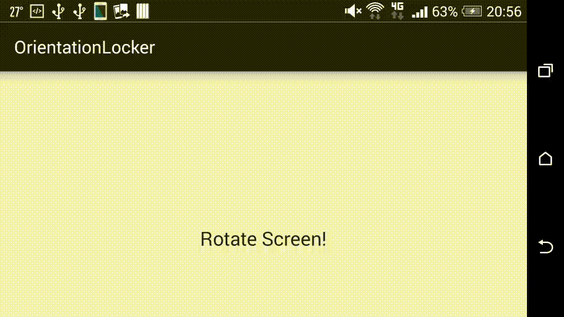

# OrientationLocker
A rotating orientation locker view for Android.

## How it looks



## Usage

Create your layout of OrientationLockerView.
OrientationLockerView is extension of RelativeLayout, so you are free to custom your layout.

```xml
<com.labo.kaji.orientationlocker.OrientationLockerView
    xmlns:android="http://schemas.android.com/apk/res/android"
    android:layout_width="wrap_content"
    android:layout_height="wrap_content"
    android:background="@drawable/bg_circle" >

    <ImageView
        android:layout_width="100dp"
        android:layout_height="100dp"
        android:src="@drawable/locker"
        android:layout_centerInParent="true"/>

</com.labo.kaji.orientationlocker.OrientationLockerView>
```

Inflate layout and add to any layout or window.

```java
mLockerView = (OrientationLockerView)View.inflate(this, R.layout.orientation_locker, null);
// In case adding view to window.
mLockerView.addToWindow(getWindow());
```

Set listener for locking event.

```java
mLockerView.setOrientationLockerViewListener(new OrientationLockerView.OrientationLockerViewListener() {
    @Override
    public void onLockerRequestLock(OrientationLockerView view, boolean lock) {
        if (lock) {
            view.getOrientationLocker().lockCurrentOrientation(SampleActivity.this);
        } else {
            view.getOrientationLocker().unlockOrientation(SampleActivity.this);
        }
    }
});
```

In onResume() and onPause(), you should start or stop screen rotation handling.

```java
@Override
protected void onResume() {
    super.onResume();
    // Start handling screen rotation.
    mLockerView.setLockerEnabled(true);
}

@Override
protected void onPause() {
    super.onPause();
    // Stop handling screen rotation.
    mLockerView.setLockerEnabled(false);
}
```

## License

MIT License.